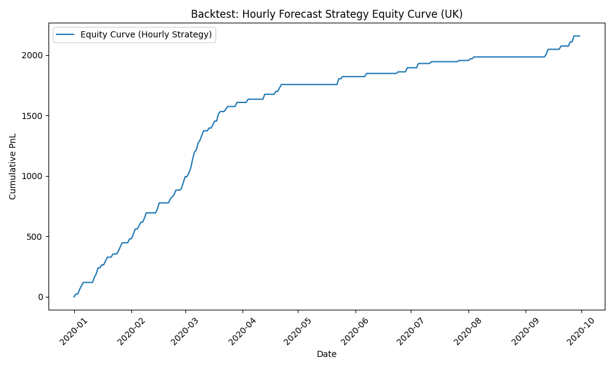

# Volatility Based Trading Strategy for the UK Power Market

## 1. Project Objective

This project designs and backtests a profitable, data driven trading strategy for the UK wholesale electricity market. It is a direct continuation of the analysis performed in the [UK Renewable Generation & Power Price Analysis](https://github.com/notshahmir/energy_trading_analysis) project.

The previous analysis uncovered that the UK power market operates in two distinct regimes:
* A **Calm Regime** on days with high renewable energy, characterised by low and stable prices.
* A **Volatile Regime** on days with low renewable energy, characterised by high price variance and extreme price spikes.

The objective of this project is to exploit this finding by building a trading system that first classifies the market regime for the upcoming day and then executes a signal based trading strategy **only on days predicted to be volatile**.

***

## 2. Data Source

As with the preceding analysis, data was sourced from the [Open Power System Data (OPSD)](https://open-power-system-data.org/) project, using their hourly time series dataset for Europe (2015 to 2020).

***

## 3. Methodology

The project was executed in two primary stages: building a system of predictive models and then creating a realistic backtesting engine to simulate the strategy's performance.

### Part A: The Two Model System

A two model system was developed to separate the strategic decision of *when* to trade from the tactical decision of *how* to trade.

1.  **The Regime Classifier**: An `LGBMClassifier` was trained to predict whether the next day will be "Calm" (0) or "Volatile" (1). A day was labelled "Volatile" if its historical price range was in the top 25%. The model was trained on a pooled, normalised dataset from the UK, Germany, and Denmark to learn more generalisable patterns.

2.  **The Hourly Price Regressor**: A second `LGBMRegressor` model was trained to predict the specific hourly price for the next day, using features like wind and solar generation, load, and time of day.

### Part B: The Backtesting Engine

A realistic historical simulation was created to assess profitability, removing any hindsight bias.

1.  **Time Based Split**: All models were trained strictly on data from **2015 to 2019** and tested on **unseen out of sample data from 2020**.

2.  **Realistic Trading Logic**: For each day in the 2020 test set, the strategy followed a two step rule:
    * First, the **Regime Classifier** predicted the day's regime. If "Calm", the strategy did nothing (PnL of £0).
    * If "Volatile", the **Hourly Price Regressor's** 24 hour forecast was used to identify the predicted cheapest hour (entry) and most expensive hour (exit). A trade was only simulated if the predicted price spread exceeded a profit threshold of £20. The PnL was then calculated on the **actual prices** at these predicted times.

***

## 4. Results and Key Findings

The backtest demonstrates that the Market Regime Strategy is both robust and consistently profitable over the test period. The final results provide a realistic assessment of the strategy's historical performance.

The **equity curve** below visualises the cumulative Profit and Loss (PnL) of the strategy.

### Performance Metrics:
| Metric | Value | Description |
| :--- | :--- | :--- |
| **Total PnL** | **£1,515.34** | The total profit generated over the test period. |
| **Sharpe Ratio** | **2.43** | Measures risk adjusted return. A value over 2 is excellent. |
| **Win Rate** | **66.7%** | The percentage of executed trades that were profitable. |
| **Max Drawdown**| **-£95.53** | The largest peak to trough loss experienced. |

The key findings are:
* **Consistent Profitability**: The clear upward trend of the equity curve and a high Sharpe Ratio show the strategy's fundamental idea is highly effective.
* **Effective Filtering**: The flat periods in the curve correspond to calm market conditions where the model correctly instructed the strategy to stay out of the market, preserving capital.

***

## 5. Conclusion and Further Improvements

This project successfully transitioned from an initial data analysis into a profitable, realistically backtested trading strategy. It proved that by classifying the market into distinct regimes and using a signal based approach, it is possible to isolate and exploit periods of high opportunity.

Potential next steps to enhance this project include:
1.  **Optimising Execution**: Experiment with different profit thresholds and more advanced entry and exit logic to improve the risk return profile.
2.  **Expanding the Feature Set**: Incorporate additional fundamental drivers like natural gas prices and carbon prices to improve the accuracy of both models.
3.  **Implementing Risk Management**: Add rules for dynamic position sizing based on the model's prediction confidence to create a more production ready system.
