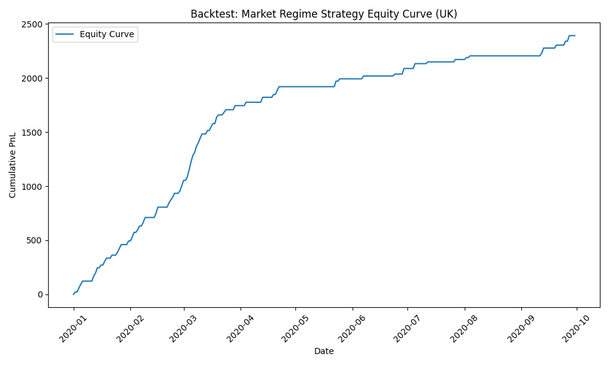

# Volatility-Based-Trading-Strategy-for-the-UK-Power-Market

## 1. Project Objective

This project designs and backtests a profitable trading strategy for the UK wholesale electricity market. It is a direct continuation of the analysis performed in the [UK Renewable Generation & Power Price Analysis](github.com/notshahmir/energy_trading_analysis) project.

The previous analysis uncovered that the UK power market operates in two distinct regimes:
* A **Calm Regime** on days with high renewable energy generation, characterized by low and stable prices.
* A **Volatile Regime** on days with low renewable energy generation, characterized by high price variance and extreme price spikes.

The objective of this project is to **exploit this finding** by building a trading system that first classifies the market regime for the upcoming day and then **only trades on days predicted to be volatile**.

***

## 2. Data Source

As with the preceding analysis, data was sourced from the [Open Power System Data (OPSD)](https://open-power-system-data.org/) project, using their hourly time series dataset for Europe (2015-2020).

***

## 3. Methodology

The project was executed in two primary stages: building a predictive model to classify market regimes and then creating a backtesting engine to simulate the trading strategy based on the model's predictions.

### Part A: The Regime Classification Model

The core of the strategy is a machine learning model trained to predict whether the next day will be "Calm" (0) or "Volatile" (1).

1.  **Defining Volatility**: A day was labelled as "Volatile" if its daily price range (`max_price` - `min_price`) was in the top 25% of all days in the dataset. All other days were labelled "Calm".
2.  **Model Selection**: A **LightGBM Classifier** was chosen for its performance and efficiency.
3.  **Feature Engineering**: The model was trained on daily aggregated features, including total wind and solar generation, mean electricity load, and day of the week.
4.  **Pan-European Training**: To build a more robust model, it was trained on a pooled dataset from the **UK, Germany, and Denmark**. This allowed the model to learn more generalisable patterns of how renewable generation impacts price volatility.
5.  **Handling Class Imbalance**: As volatile days are rare, the model was trained using a `scale_pos_weight` parameter. This technique forces the model to pay significantly more attention to correctly identifying the rare "Volatile" class, optimising for **recall** (finding opportunities) over precision.

### Part B: The Backtesting Engine

A historical simulation, or backtest, was created to assess the profitability of the strategy.

1.  **Time-Based Split**: To ensure a fair and realistic test, the model was trained strictly on data from **2015-2019** and tested on **unseen out-of-sample data from 2020**. This prevents any lookahead bias.
2.  **Trading Logic**: For each day in the 2020 test set, the strategy followed a simple rule:
    * If the model predicted **"Calm" (0)**, the strategy did nothing, for a Profit & Loss (PnL) of **£0**.
    * If the model predicted **"Volatile" (1)**, the strategy executed an idealised "virtual battery" trade, simulating buying at the day's lowest price and selling at the day's highest price. The PnL was therefore the full daily `price_range`.

***

## 4. Results and Key Findings

The backtest demonstrates that the Market Regime Strategy is both highly and consistently profitable over the 10 month test period.

The **equity curve** below visualises the cumulative PnL of the strategy.

The key findings from this result are:
* **Consistent Profitability**: The clear upward trend, reaching a final cumulative PnL of nearly **£2,400**, shows the strategy's fundamental idea is highly effective.
* **Effective Filtering**: The flat periods in the curve correspond to calm market conditions where the model correctly instructed the strategy to stay out of the market, preserving capital.
* **Robustness**: The strategy shows remarkable resilience, with no significant "drawdowns" (periods of losing money), confirming the value of only trading in pre identified volatile conditions.

***

## 5. Conclusion and Further Improvements

This project successfully transitioned from an initial data analysis into a profitable, data-driven trading strategy. It proved that by classifying the market into distinct regimes, it's possible to isolate periods of high opportunity and filter out periods of low opportunity.

Potential next steps to enhance this project include:
1.  **Refining the Trading Signal**: Instead of an idealised "perfect day" trade, develop an hourly price prediction model that generates more realistic entry and exit signals *within* the volatile days.
2.  **Expanding the Feature Set**: Incorporate additional fundamental drivers like natural gas prices, carbon prices (EUAs), and temperature forecasts to improve the accuracy of the regime classifier.
3.  **Implementing Risk Management**: Add rules for dynamic position sizing based on the model's prediction confidence or implement stop loss mechanisms to create a more production ready system.
